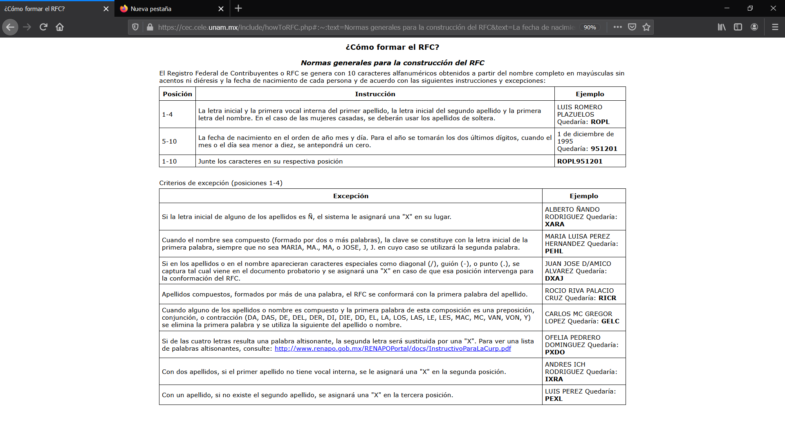
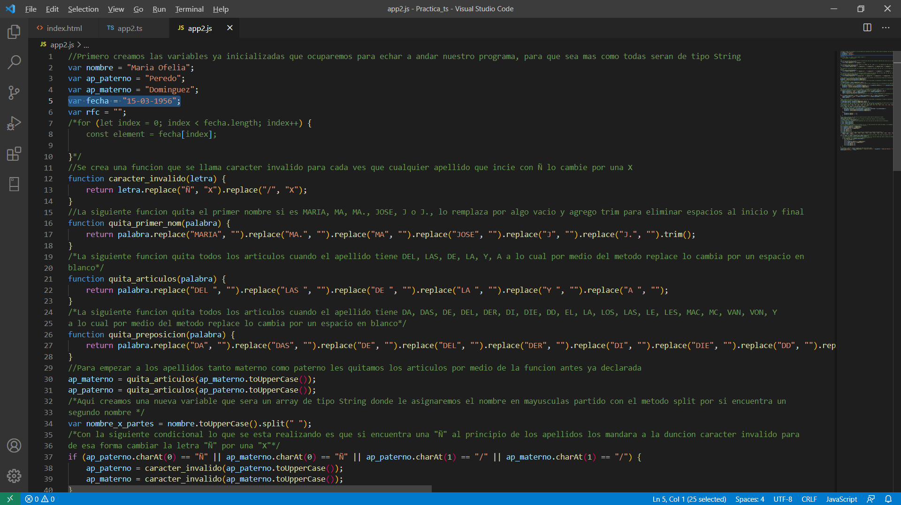

_________________________________

### TECNOLOGICO NACIONAL DE MEXICO
### INSTITUTO TECNOLOGICO DE MILPA ALTA II
### MEAN STACK PARA FRONT-END
### PROFESOR:
#### ROLDAN AQUINO SEGURA 
### ALUMNO:
#### ALEJANDRO POZOS RIVERA
### TEMA:
#### GENERACION DE RFC POR MEDIO DE TS
#### NUMERO DE UNIDAD: 2°
### FECHA: 
#### 15 DE ABRIL DE 2021

 
 
 
 

- Adjunto link del archivo original de las [RFC en .ts](https://github.com/Alex-pozos/Tareas/tree/main/Proyecto_RFC/Docs/rfc.ts) y [RFC en .js](https://github.com/Alex-pozos/Tareas/tree/main/Proyecto_RFC/Docs/rfc.js)

#### En primera parte tenemos el documento con todas las indicaciones para la creación de nuestro RFC. 

#### Ahora se presentan las capturas de pantalla del código en Typescript comentado para una mayor compresión.

 

 

 

#### Ejecutamos el modo vigilante para que se guarden los cambios al mismo tiempo en JavaScript.

 

#### Verificamos que en realidad se hayan realizado los cambios en el documento de JavaScript en conjunto con los comentarios de línea y de bloque especificados en el documento de TypeScript.   

 

 

 