# Tarea Actividad1 
 
### Bibliografia de los computologos

### Introducción 

En el siguiente trabajo se hablará sobre algunos de principales computologos, así mismo también tocaremos algunos de los temas sobre las aportaciones que estos hicieron a la computación.
 

#### Charles Babbage
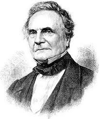

##### Biografía
Fue un matemático de origen británico nacido en Teignmouth Inglaterra el 26 de diciembre de 1791.
Charles Babbage se licenció en la Universidad de Cambridge en 1814. Poco después, en 1815, fundó con J. Herschel la Analytic Society con el propósito de renovar de la enseñanza de las matemáticas en Inglaterra. En 1816 fue elegido miembro de la Royal Society y en 1828 ingresó en su universidad como profesor de matemáticas.
En 1833 completó su "máquina diferencial", después de esto, Babbage se volcó en el proyecto de diseñar una "máquina analítica".Para esta realización contó con fondos del gobierno inglés y con la colaboración de la que está considerada como la primera programadora de la historia, Ada Lovelace, hija del poeta Lord Byron.
En compañía de Ada Lovelace, que empleó mucho de su tiempo en la publicación de las ideas de su maestro, Babbage dedicó sus últimos años y recursos a una máquina infalible que fuese capaz de predecir los ganadores de las carreras de caballos. 

##### Aportaciones
- En 1833 creó la “máquina diferencial” la cual permitía calcular logaritmos e imprimirlos de 1 a 108.000 con notable precisión, y formuló los fundamentos teóricos de cualquier autómata de cálculo.

- Después de esto, Babbage se volcó en el proyecto de diseñar una "máquina analítica" que fuese capaz de procesar cualquier secuencia de instrucciones aritméticas.
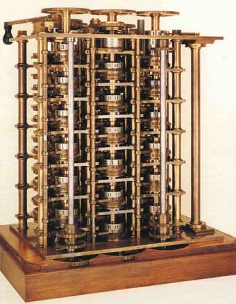

- En honor de Lady Ada Lovelace, el Departamento de Defensa de los Estados Unidos denominó ADA a un lenguaje de programación de computadoras de alto nivel.

 

#### Herman Hollerith
 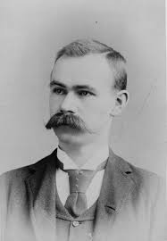

##### Biografía
Nació en Buffalo, Nueva York, el 29 de febrero de 1860, fue un hombre que revolucionó el tratamiento a gran escala de información mediante la automatización, y por tanto el primer informático. Considerado uno de los pioneros de la informática por su invención de las máquinas estadísticas de tarjetas o fichas perforadas, con las que logró automatizar los trabajos de cómputo y clasificación de grandes volúmenes de información. 
Tras graduarse como ingeniero de minas por la Universidad de Columbia (1879), Herman Hollerith inició su actividad profesional en la Oficina Nacional del Censo.
A lo largo de la década de 1880, Hollerith probó con éxito su invento en diversas instituciones públicas y se aplicó a perfeccionarlo; la principal mejora fue sustituir la cinta de papel por una serie de tarjetas perforadas, sistema que patentó en 1889. Ese mismo año, Hollerith sometió a la consideración del gobierno de los Estados Unidos un proyecto para construir una máquina estadística de fichas perforadas que fue finalmente utilizada para computar los datos del censo de 1890. La máquina tabuladora de Hollerith fue capaz de procesar los datos de los 60 millones de ciudadanos estadounidenses en menos de tres años.

##### Aportaciones
- En 1889 perfeciono la máquina tabuladora, la principal mejora fue sustituir la cinta de papel por una serie de tarjetas perforadas, sistema que patentó en ese mismo año.
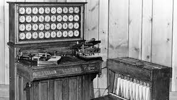
- En 1896 fundó la Tabulating Machine Company, empresa dedicada a la fabricación y comercialización de máquinas procesadoras de datos. Esta empresa pasó a llamarse en 1924 International Business Machines (IBM), y se convertiría tras la Segunda Guerra Mundial en una de las compañías punteras del sector informático.
 

#### Alan Mathison Turing
 

##### Biografía
También conocido como el padre de la informática modera, fue un brillante matemático, criptoanalista e informático teórico nacido el 23 de Junio de 1912 en Maida Vale un distrito residencial al oeste de Londres.
Pasó sus primeros trece años en la India, donde su padre trabajaba en la Administración colonial. De regreso al Reino Unido, estudió en el King's College y, tras su graduación, se trasladó a la Universidad estadounidense de Princeton, donde trabajó con el lógico Alonzo Church.
Turing, además de ser un brillante científico era homosexual, lo cual le costó la vida el siete de junio de 1954. 
Fue un matemático y filósofo norteamericano que sentó en 1948 las bases de la Cibernética, teoría sobre el control y la comunicación en máquinas y animales.
En el año 1948, Norbert Wiener publicó en Nueva York su Cybernetics, or Control and Communication in the Animal and the Machine (Cibernética o el control y comunicación en animales y máquinas), libro escrito en clave netamente matemática en el que propuso su teoría del control y la comunicación en máquinas y animales.
El 8 de junio de 1954, Turing fue encontrado muerto por su personal de limpieza. Un examen post-morten estableció que la causa de la muerte fue envenenamiento por cianuro ingerida al parecer al comer parte de una manzana bañada en esa sustancia que además se encontraba en la mesita al lado de su cama.
##### Aportaciones
- En 1937 publicó un célebre artículo en el que definió una máquina calculadora de capacidad infinita (máquina de Turing) que operaba basándose en una serie de instrucciones lógicas, sentando así las bases del concepto moderno de algoritmo.
- Formalizó los conceptos de algoritmo y computación con su máquina de Turing
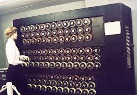

- Es considerado el padre de la inteligencia artificial
- Su participación en el equipo de criptoanálisis de la máquina de criptografía alemana Enigma, que fue una maquina electro mecánica con rotor usada para enviar mensajes cifrados por la Alemania nazi durante la Segunda Guerra Mundial.

 

#### Claude Elwood Shannon 

##### Biografía
También conocido como el padre del Bit, nació el 30 de abril de1 916, Petoskey Michigan Estados Unidos y falleció  24 de febrero de 2001, Medford, Massachusetts,Estados Unidos.
Shannon es reconocido por haber fundado el campo de la teoría de la información con la publicación Una teoría matemática de la comunicación, que supuso un hito en 1948. Es quizás igualmente conocido por haber sentado las bases de la teoría del diseño del ordenador digital y el circuito digital en 1937.
En 1932 comenzó sus estudios de bachillerato, destacando en ciencias y matemáticas. En esa época desarrolló un sistema de comunicación telegráfica entre su casa y otra a corta distancia.
En 1936 ingresó en la universidad de Michigan, terminó sus estudios de ingeniería eléctrica y matemáticas en el "Massachusetts Institute of Technology" (MIT). Su proyecto de titulación en ingeniería consistió en la aplicación del álgebra de Boole al problema de la conmutación eléctrica.
Durante el curso 1940-41 permaneció en el "Institute for Advanced Study", en Princeton, trabajando con el matemático alemán Hermann Weyl (1885-1955). Fue entonces cuando comenzó a desarrollar sus ideas sobre la teoría de la información.

nació en Michigan (EE. UU.) en plena Primera Guerra Mundial (1916). Entre los mayores logros de Claude Shannon se encuentra el sentar las bases de la teoría del diseño de circuitos digitales, pero además fue capaz de rescatar el álgebra booleana 70 años después de su nacimiento y demostrar que existía en ella una relación lógico-numérica.
##### Aportaciones
Una teoría matemática de la comunicación es un importante e influyente artículo ideado por Claude Elwood Shannon en 1948, conocido por ser el padre de la teoría de la información​ Shannon trabajó en ella durante ocho años, mientras era empleado de los laboratorios Bell.

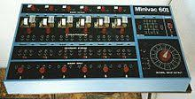

- ###### El artículo de Shannon expuso los elementos básicos de la comunicación:
    - Una fuente de información que produce un mensaje.
    - Un transmisor que opera en el mensaje para crear una señal que puede ser enviado a través de un canal.
    - Un canal que es el medio para llevar la información.
    - Un receptor que transforma la señal.
    - Un destino, que puede ser una persona o una máquina.

- ###### Circuitos de relés complejos y álgebra booleana
    - Intentando simplificar centralitas telefónicas de relés, se dio cuenta de que estos podían usarse para hacer cálculos. Sumado esto a su gusto por la lógica y el álgebra booleana, pudo desarrollar esta idea durante el verano de 1937, que pasó en los laboratorios Bell en la ciudad de Nueva York.
 

#### John Von Neumann
 

##### Biografía
Nació en Budapest el 28 de diciembre de 1903, fue un gran matemático del siglo XX que realizó contribuciones importantes en la física cuántica, análisis funcional, teoría de conjuntos, ciencias de comunicación, economía, análisis numérico, cibernética, hidrodinámica de expresiones, estadística y otros campos de las matemáticas.
Un niño prodigio que estudió matemáticas y química en su ciudad natal, Berlín y Zurich. Recibió su doctorado en matemáticas de la Universidad de Budapest a los 23 años, un año antes que se cerrara a los estudiantes de origen hebreo. Fue profesor en Berlín y Hamburgo en los años 20. 
Von Neumann se casó dos veces. La primera de ellas fue con Mariette Kovesi en 1930, justo antes de emigrar a los Estados Unidos. Tuvieron una hija (la único hija que tuvo von Neumann), Marina. Actualmente, es una distinguida profesora de comercio internacional y política pública en la Universidad de Michigan. La pareja se divorció en 1937. En 1938, von Neumann se casó con klari Dan, a quien había conocido durante sus últimos viajes de vuelta a Budapest antes del estallido de la Segunda Guerra Mundial.
En 1955, von Neumann fue diagnosticado de cáncer de páncreas. Un año y medio más tarde, Von Neumann murió sumido en un gran dolor. Mientras estaba en el Hospital Walter Reed en Washington, DC, invitó a un sacerdote católico, el Padre Anselmo Strittmatter, perteneciente a la orden benedictina, que fue a visitarlo (una decisión que conmocionó a algunos de los amigos de von Neumann). Dicho sacerdote le administró los últimos sacramentos. Murió bajo seguridad militar para impedir que revelase secretos militare mientras se encontraba medicado. John von Neumann fue enterrado en el cementerio de Princeton en Princeton, Mercer County, New Jersey.

##### Aportaciones
- Fue pionero de la computadora digital moderna y de la aplicación de la teoría de operadores a la mecánica cuántica.
- La primera computadora en usar el citado concepto fue la llamada EDVAC (Electronic Discrete-Variable Automatic Computer, es decir 'computadora automática electrónica de variable discreta'), desarrollada por Von Neumann, Eckert y Mauchly. Los programas almacenados dieron a las computadoras flexibilidad y confiabilidad, haciéndolas más rápidas y menos sujetas a errores que los programas mecánicos.
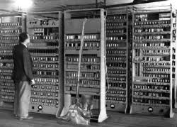

- Fue creador de las máquinas de autorreplicarse, lo que le llevó al concepto de lo que ahora llamamos máquinas de Von Neumann o autómatas celulares.
-  Donald Knuth denomina a von Neumann como el inventor, en 1945, del conocido algoritmo merge sort, en el cual la primera y segunda mitad de un array (vector) son cada una clasificadas recursivamente y luego fusionadas juntas.
 

#### Gordon Moore 
 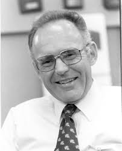

##### Biografía
Nació en la ciudad de San Francisco, en el estado de California, Estados Unidos, el 3 de enero del año 1929. Se crió en el seno de una familia promedio de clase trabajadora; su papá era el sheriff del pueblo y su madre se ocupaba de los oficios del hogar.
Luego, cuando su padre fue trasladado de empleo, la familia de Moore tuvo que mudarse a Redwood City, una localidad ubicada en la península de San Francisco. La principal actividad comercial del pueblo era la pesca.
Fue durante los últimos años de bachillerato en la Sequoia High School cuando nació su apasionamiento por la química y la matemática. Motivado por su amor a las ciencias exactas, Gordon inició estudios en la Universidad estatal de San José de California.
En esa época conoció a su esposa, Betty Irene Whitaker. En 1950 se matriculó en la Universidad de Berkeley (California), de donde egresó con un título en química. Tenía entonces 21 años de edad.
En la decada de los 50´s surgió entonces la oportunidad de trabajar en el centro tecnológico de Palo Alto, California, con el inventor del transistor, William Shockley. El afamado investigador renunció a los Laboratorios Bell y fundó la empresa Shockley Semiconductor y, como estaba buscando nuevos talentos, contrató al joven químico.

##### Aportaciones
- En 1957 crearon un equipo que estaba integrado por Gordon Moore, Robert Noyce, Victor Grinich, Julius Blank, Jay Last, Jean Hoerni, Sheldon Roberts y Eugene Kleiner. Apoyados por Fairchild Camera and Instrument y con el aporte monetario de 500 dólares cada uno, fundaron Fairchild Semiconductor Corporation, con sede en Mountain View (California).
- En 1968 se separaron de Fairchild.Así nació la empresa Intel (Integrated Electronics Corporation), cuya vicepresidencia fue asumida inicialmente por Gordon en 1975; años después fue su presidente y CEO (presidencia ejecutiva).
- Intel sacó a la venta el microprocesador 4004 en el año 1971.
- Creo la ley Moore que cita: Los semiconductores que se hicieron cada vez más pequeños y rápidos en el procesamiento de información se inspiraron en la conocida ley de Moore. Según este vaticinio o ley empírica, en términos generales la tecnología electrónica se duplica cada año.
 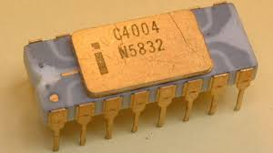
 

#### Alonzo Church
 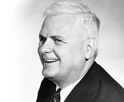

##### Biografía
Nacido 14 de junio de 1903, estableció el concepto de calculabilidad y su demostración de la indecidibilidad de la lógica de primer orden, conocido como Tesis de Church. 
De sus trabajos es notable su concepto de calculabilidad de una función y su demostración de la indecidibilidad de la lógica de primer orden, es decir, del cálculo cuantificacional elemental.Desarrolló el cálculo de conversión lambda, que permite efectuar operaciones lógicas con variables generalizadas y la existencia de problemas indecidibles.
Este resultado unido al trabajo de Turing sobre el problema de parada en la Máquina de Turing, que también demostraba la existencia de un problema irresoluble por medios mecánicos, demostraron que tenían capacidades de computo equivalentes, dando lugar a la Tesis Church-Turing. Destacan sus obras "The Calculi of Lambda-Conversion" (Cálculo de conversión Lambda) en 1941, e "Introduction to Mathematical Logic" (Introducción a la lógica matemática) en 1944.
##### Aportaciones
- Desarrolló el cálculo de conversión Lambda en 1936, que permite efectuar operaciones lógicas con variables generalizadas, demostrando la presencia de problemas indecidibles.
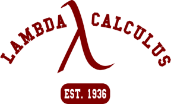
- Introducción a la lógica matemática 1944.
- Journal of Symbolic Logic, publicación que él mismo dirigía y editaba desde 1936.
 

#### Noam Chomsky
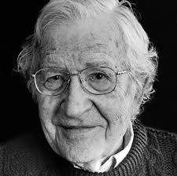

##### Biografía
Nacido en 1928 en Filadelfia, es profesor de lingüística en el MIT, Estados Unidos, y una de las figuras más destacadas de la lingüística del siglo XX, con grandes aportaciones en el campo de la informática. Estudió en Pensilvania, donde se doctoró en 1955 con una tesis sobre el análisis transformacional, tras lo que pasó a integrarse en el equipo docente del MIT.
Sus importantes aportaciones a la teoría de autómatas y al estudio de los lenguajes formales. Dichas aportaciones han resultado elementos indispensables para la construcción de compiladores y traductores que puedan servir de intérpretes válidos entre las órdenes que dan los seres humanos y su correcta recepción y aplicación por máquinas automáticas.
Puede decirse que el papel desempeñado por Chomsky ha resultado crucial en este importante campo, pues fue imprescindible para dar el siguiente paso tras los primeros computadores, el ENIAC o el propio ACE de Alan Turing, programados directamente en código binario, de forma que a mediados de 1954 su obra ya influyó en la especificación del borrador para el lenguaje Fortran, y en la conocida notación Backus-Naur.

##### Aportaciones
- La jerarquía de Chomsky, que estableció en 1956 en su obra "Three models for the description of language" se convirtió en un concepto central en informática. Así, los lenguajes formales (que no admiten excepciones a las reglas) se dividen en cuatro niveles (tres en el estudio original), que son: 
    1.  Lenguajes regulares.  
    2.	Lenguajes libres del contexto.
    3.	Lenguajes sensibles al contexto.
    4.	Lenguajes recursivamente enumerables.
- A aportado elementos indispensables para la construcción de compiladores y traductores que puedan servir de intérpretes válidos.
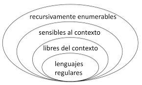