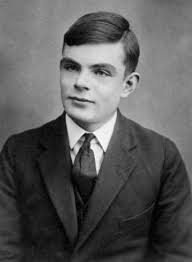
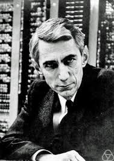
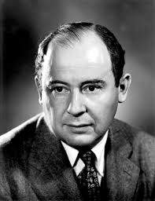

# Tarea Actividad1 
 
### Bibliografia de los computologos

### Introducción 

En el siguiente trabajo se hablará sobre algunos de principales computologos, así mismo también tocaremos algunos de los temas sobre las aportaciones que estos hicieron a la computación.
 

#### Charles Babbage

 
Fue un matemático de origen británico nacido en Teignmouth Inglaterra el 26 de diciembre de 1791. Especialista en el área de la matemática y la computación, fue así como en 1833 creó la “máquina diferencial” la cual permitía calcular logaritmos e imprimirlos.
Al terminar la “máquina diferencial” dirigió sus esfuerzos a diseñar una máquina analítica que procesara instrucciones aritméticas.

#### Herman Hollerith
 

Nació en Buffalo, Nueva York, el 29 de febrero de 1860, fue un hombre que revolucionó el tratamiento a gran escala de información mediante la automatización, y por tanto el primer informático. Inventor de la máquina tabuladora y fundador de una de las empresas que se fusionaron en CRT, posteriormente renombrada como IBM.

 

#### Alan Mathison Turing
 

También conocido como el padre de la informática modera, fue un brillante matemático, criptoanalista e informático teórico nacido el veintitrés de Junio de 1912 en Maida Vale un distrito residencial al oeste de Londres. Turing, además de ser un brillante científico era homosexual, lo cual le costó la vida el siete de junio de 1954.
Turing es mundialmente conocido por cuatro hechos:
•	Formalizó los conceptos de algoritmo y computación con su máquina de Turing
•	Es considerado el padre de la inteligencia artificial
•	Su participación en el equipo de criptoanálisis de la máquina de criptografía alemana Enigma fue clave
•	Fue una víctima más de la mentalidad reaccionaria puritana del mundo anglosajón
Norbert Wiener 
 
Fue un matemático y filósofo norteamericano que sentó en 1948 las bases de la Cibernética, teoría sobre el control y la comunicación en máquinas y animales.
En el año 1948, Norbert Wiener publicó en Nueva York su Cybernetics, or Control and Communication in the Animal and the Machine (Cibernética o el control y comunicación en animales y máquinas), libro escrito en clave netamente matemática en el que propuso su teoría del control y la comunicación en máquinas y animales.
 
#### Claude Elwood Shannon 

 
También conocido como el padre del Bit, nació en Michigan (EE. UU.) en plena Primera Guerra Mundial (1916). Entre los mayores logros de Claude Shannon se encuentra el sentar las bases de la teoría del diseño de circuitos digitales, pero además fue capaz de rescatar el álgebra booleana 70 años después de su nacimiento y demostrar que existía en ella una relación lógico-numérica.

 
#### John Von Neumann
 

Nació en Budapest el 28 de diciembre de 1903, fue un gran matemático del siglo XX que realizó contribuciones importantes en la física cuántica, análisis funcional, teoría de conjuntos, ciencias de comunicación, economía, análisis numérico, cibernética, hidrodinámica de expresiones, estadística y otros campos de las matemáticas.
Y también contribuyó al estudio de algoritmos. Donald Knuth denomina a von Neumann como el inventor en 1945 del “algoritmo de merge sort”.

Y entre 1944 y 1946 colaboró en la elaboración de un informe para el ejército sobre las posibilidades que ofrecía el desarrollo de las primeras computadoras electrónicas; de su contribución destaca la concepción de una memoria que actuase secuencialmente y no solo registrara datos numéricos de un problema sino que además almacenase un programa con las instrucciones para la resolución del mismo.
 

#### Gordon Moore 
 

Nacido en San Francisco, California el 3 de enero de 1929, durante su estancia en Fairchild Semiconductor, Moore publicaría un artículo de investigación que marcaría el mundo de la ingeniería electrónica. El 19 de abril de 1965, la revista Electronics publicó un documento escrito por Moore en el que expresaba, en base a sus observaciones, una visión sobre la complejidad de los circuitos integrados y los costes de fabricación. 
Gordon Moore permanecería en Fairchild Semiconductor hasta el año 1968, momento en el que se unió a Robert Noyce para emprender un nuevo proyecto: Intel Corporation.

#### Alonzo Church
 

Nacido 14 de junio de 1903, estableció el concepto de calculabilidad y su demostración de la indecidibilidad de la lógica de primer orden, conocido como Tesis de Church. Desarrolló el cálculo de conversión Lambda en 1936, que permite efectuar operaciones lógicas con variables generalizadas, demostrando la presencia de problemas indecidibles
Este resultado unido al trabajo de Turing sobre el problema de parada en la Máquina de Turing, que también demostraba la existencia de un problema irresoluble por medios mecánicos, demostraron que tenían capacidades de computo equivalentes, dando lugar a la Tesis Church-Turing. Destacan sus obras "The Calculi of Lambda-Conversion" (Cálculo de conversión Lambda) en 1941, e "Introduction to Mathematical Logic" (Introducción a la lógica matemática) en 1944.
 

#### Noam Chomsky

Nacido en 1928 en Filadelfia, es profesor de lingüística en el MIT,sus importantes aportaciones a la teoría de autómatas y al estudio de los lenguajes formales. Dichas aportaciones han resultado elementos indispensables para la construcción de compiladores y traductores que puedan servir de intérpretes válidos entre las órdenes que dan los seres humanos y su correcta recepción y aplicación por máquinas automáticas.
La jerarquía de Chomsky, que estableció en 1956 en su obra "Three models for the description of language" se convirtió en un concepto central en informática. Así, los lenguajes formales (que no admiten excepciones a las reglas) se dividen en cuatro
niveles (tres en el estudio original), que son: 
1.	Lenguajes regulares.  
2.	Lenguajes libres del contexto.
3.	Lenguajes sensibles al contexto.
4.	Lenguajes recursivamente enumerables.

