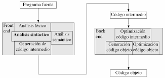

<strong><h4>
<p style="text-align: center;">
TECNOLOGICO NACIONAL DE MEXICO 
</p>
<p style="text-align: center;">
INSTITUTO TECNOLOGICO DE MILPA ALTA II
</p>
<p style="text-align: center;">
TALLER DE INVESTIGACION 1
</p>
<p style="text-align: center;"> 
PROFESOR:
</p>
<p style="text-align: center;">
ROLDAN AQUINO SEGURA 
</p>
<p style="text-align: center;">
ALUMNO:
</p>
<p style="text-align: center;">
ALEJANDRO POZOS RIVERA
</p>
<p style="text-align: center;">
TEMA:
</p>
<p style="text-align: center;">
GENERACION DE CODIGO INTERMEDIO
</p>
<p style="text-align: center;">
NUMERO DE UNIDAD: 2°
</p>
<p style="text-align: center;">
FECHA: 
</p>
<p style="text-align: center;">
01 DE DICIEMBRE DE 2020
</p>
</h4>
</strong>
<br>
<br>
<br>
<br>
#### Generación de código intermedio 

En el proceso de traducir un programa fuente a código destino, un compilador puede construir una o más representaciones intermedias, las cuales pueden tener una variedad de formas. Los árboles sintácticos son una forma de representación intermedia; por lo general, se utilizan durante el análisis sintáctico y semántico.
Después del análisis sintáctico y semántico del programa fuente, muchos compiladores generan un nivel bajo explícito, o una representación intermedia similar al código máquina, que podemos considerar como un programa para una máquina abstracta. Esta representación intermedia debe tener dos propiedades importantes: debe ser fácil de producir y fácil de traducir en la máquina destino.
 <br>



<br>
<br>

**Representación intermedia**

Códigos intermedios puede ser representado en una variedad de formas y tienen sus propios beneficios.
**Alto nivel IR** - Alto nivel de representación de código intermedio está muy cerca de la lengua de origen. Pueden ser fácilmente generados desde el código fuente y podemos aplicar fácilmente modificaciones de código para mejorar el rendimiento. Pero para optimización de la máquina destino, es menos preferido.
**Bajo Nivel IR** - Este es cerca de la máquina de destino, lo que lo hace adecuado para registro y asignación de memoria, un conjunto de instrucciones selección, etc. es bueno para optimizaciones dependientes de la máquina.
Código intermedio puede ser específica para cada idioma (p. ej., código de bytes de Java) o independiente de la lengua (tres-código de dirección).

**Código en tres direcciones**

- Generación de código intermedio recibe la entrada de su predecesor, analizador semántico, en la forma de un árbol de sintaxis anotado. 
- Árbol de sintaxis que luego se puede convertir en una representación lineal, por ejemplo, postfix notación. Código intermedio tiende a ser código independiente de la máquina. Por lo tanto, generador de código supone que tiene número ilimitado de almacenamiento en memoria (registro) para genera el código. 

**Ejemplo:**
```
a = b + c * d
```

El generador de código intermedio, tratar de dividir esta expresión en subexpresiones y, a continuación, generar el código correspondiente.
```
r1 = c * d;
r2 = b + r1; 
r3 = r2 + r1;
a = r3
```
R que se utilizan como registros en el programa de destino.

Un código de dirección tiene un máximo de tres direcciones para calcular la expresión. Un código de dirección puede estar representado en dos formas : cuádruples y triples.


**Cuadruplica**

Cada instrucción cuadruplica exposición se divide en cuatro campos: operador, arg1, arg2, y resultado. El ejemplo anterior se representa a continuación cuadruplica en formato:
<table style="width: 100%; text-align: center;">
  <tr>
    <td style="width: 33%;">Op.</td>
    <td style="width: 33%;">Arg1</td>
    <td style="width: 33%;">Arg2</td>
    <td style="width: 33%;">Resultado</td>
  </tr>
  <tr>
    <td style="width: 33%;">*</td>
    <td style="width: 33%;">c</td>
    <td style="width: 33%;">d</td>
    <td style="width: 33%;">r1</td>
  
  </tr>
  <tr>
    <td style="width: 33%;">+</td>
    <td style="width: 33%;">b</td>
    <td style="width: 33%;">r1</td>
    <td style="width: 33%;">r2</td>
  </tr>
  <tr>
    <td style="width: 33%;">+</td>
    <td style="width: 33%;">r2</td>
    <td style="width: 33%;">r1</td>
    <td style="width: 33%;">r3</td>
  </tr>
  <tr>
    <td style="width: 33%;">=</td>
    <td style="width: 33%;">r3</td>
    <td style="width: 33%;"></td>
    <td style="width: 33%;">a</td>
  </tr>
</table>


**Triples**
Cada instrucción en triples presentación tiene tres campos: op, arg1, arg2. Los resultados de las respectivas sub-expresiones son indicados por la posición de expresión. Similitud con Triples representan DAG y árbol de sintaxis. Son equivalentes a DAG al tiempo que representan las expresiones.

<table style="width: 100%; text-align: center;">
  <tr>
    <td style="width: 33%;">Op.</td>
    <td style="width: 33%;">Arg1</td>
    <td style="width: 33%;">Arg2</td>
  </tr>
  <tr>
    <td style="width: 33%;">*</td>
    <td style="width: 33%;">c</td>
    <td style="width: 33%;">d</td>
  
  </tr>
  <tr>
    <td style="width: 33%;">+</td>
    <td style="width: 33%;">b</td>
    <td style="width: 33%;">(0)</td>
  </tr>
  <tr>
    <td style="width: 33%;">+</td>
    <td style="width: 33%;">(1)</td>
    <td style="width: 33%;">(0)</td>
  </tr>
  <tr>
    <td style="width: 33%;">=</td>
    <td style="width: 33%;">(2)</td>
    <td style="width: 33%;">.</td>
  </tr>
</table>


