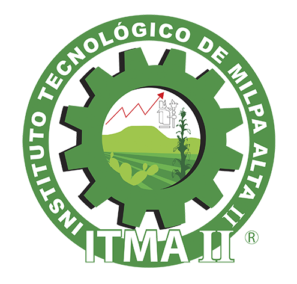

_________________________________

### TECNOLOGICO NACIONAL DE MEXICO
### INSTITUTO TECNOLOGICO DE MILPA ALTA II
### LENGUAJES AUTOMATAS II
### PROFESOR:
#### ROLDAN AQUINO SEGURA 
### ALUMNO:
#### ALEJANDRO POZOS RIVERA
### TEMA:
#### TIPOS DE OPTIMIZACION
#### NUMERO DE UNIDAD: 3°
### FECHA: 
#### 01 DE ENERO DE 2021

 
 
 
 

### 3.1 Tipos De Optimización
-  La optimización es un proceso que tiene a minimizar o maximizar alguna variable de rendimiento, generalmente tiempo, espacio, procesador, etc.
- La optimización se realiza reestructurando el código de tal forma que el nuevo código generado tenga mayores beneficios.

- #### 3.1.1 Locales
    - La optimización local se realiza sobre módulos del programa. En la mayoría de las ocasiones a través de funciones, métodos, procedimientos, clases, etc.
    Las características de las optimizaciones locales es que solo se ven reflejados en dichas secciones. La optimización local sirve cuando un bloque de programa o sección es crítico por ejemplo: la E/S, la concurrencia, la rapidez y confiabilidad de un conjunto de instrucciones.

    - **EJEMPLOS:**

        **1-  Ejecución en tiempo de compilación** 
        Precalcular  expresiones constantes (con constantes o variables cuyo valor no cambia).
        3 ! i = 5
        j = 4
        f = j + 2.5
        !
        j = 4
        f = 6.5

        **2- Reutilización de expresiones comunes** 
        a = b + c
        d = a - d
        e = b + c
        f = a - d
        !
        a = b + c
        d = a - d
        e = a
        f = a – d

        **3-  Propagación de copias** 
        Ante instrucciones f=a, sustituir todos los usos de f por a.
        a = 3 + i
        f = a
        b = f + c
        d = a + m
        m = f + d
        !
        a = 3 + i
        b = a + c
        d = a + m
        m = a + d

        **4-  Eliminación redundancias en acceso matrices** 
        Localizar expresiones comunes en cálculo direcciones de matrices.

        **5- Transformaciones algebraicas:** 
        Aplicar propiedades matemáticas para simplificar expresiones

        -   Eliminación secuencias nulas
        -   Reducción de potencia

- #### 3.1.2 Ciclos
    - Los ciclos son una de las partes más esenciales en el rendimiento de un programa dado que realizan acciones repetitivas, y si dichas acciones están mal realizadas, el problema se hace N veces más grandes. La mayoría de las optimizaciones sobre ciclos tratan de encontrar elementos que no deben repetirse en un ciclo. 
    El problema de la optimización en ciclos y en general radica en que es muy difícil saber el uso exacto de algunas instrucciones. Así que no todo código de proceso puede ser optimizado. Otro uso de la optimización puede ser el mejoramiento de consultas en SQL o en aplicaciones remotas (sockets, E/S, etc.).El problema de la optimización en ciclos y en general radica es que muy difícil saber el uso exacto de algunas instrucciones. Así que no todo código de proceso puede ser optimizado.

- #### 3.1.3 Globales
    - La optimización global se da con respecto a todo el código.
    - Este tipo de optimización es más lenta pero mejora el desempeño general de todo programa.

    - Las optimizaciones globales pueden depender de la arquitectura de la máquina.

    **Optimización global**

    - En algunos casos es mejor mantener variables globales para agilizar los procesos (el proceso de declarar variables y eliminarlas toma su tiempo) pero consume más memoria.
    - Algunas optimizaciones incluyen utilizar como variables registros del CPU, utilizar         instrucción  es  enensamblador.

- #### 3.1.4 De Mirilla
    - La optimización de mirilla trata de estructurar de manera eficiente el flujo del programa, sobre todo en instrucciones de bifurcación como son las decisiones, ciclos y saltos de rutinas. La idea es tener los saltos lo más cerca de las llamadas, siendo el salto lo más pequeño posible.

    **Ideas básicas:**

    - Se recorre el código buscando combinaciones de instrucciones que pueden ser reemplazadas por otras equivalentes más eficientes.
    - Se utiliza una ventana de n instrucciones y un conjunto de patrones de transformación (patrón, secuencias, remplazan).
    - Las nuevas instrucciones son reconsideradas para las futuras optimizaciones. 
    **Ejemplos:**

    - Eliminación de cargas innecesarias
    - Reducción de potencia
    - Eliminación de cadenas de saltos