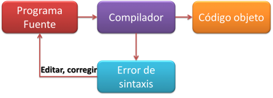
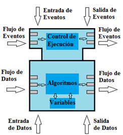
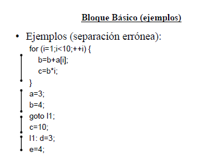

_________________________________

### TECNOLOGICO NACIONAL DE MEXICO
### INSTITUTO TECNOLOGICO DE MILPA ALTA II
### LENGUAJES AUTOMATAS II
### PROFESOR:
#### ROLDAN AQUINO SEGURA 
### ALUMNO:
#### ALEJANDRO POZOS RIVERA
### TEMA:
#### COSTOS 
#### NUMERO DE UNIDAD: 3°
### FECHA: 
#### 01 DE ENERO DE 2021

 
 
 
 

### 3.2 Costos
-  Los costos son el factor más importante a tomar en cuenta a la hora de optimizar ya que en ocasiones la mejora obtenida puede verse no reflejada en el programa final, pero si ser perjudicial para el equipo de desarrollo.

- La optimización de una pequeña mejora tal vez tenga una pequeña ganancia en tiempo o en espacio, pero sale muy costosa en tiempo en generarla.

- Pero en cambio si esa optimización se hace por ejemplo en un ciclo, la mejora obtenida puede ser N veces mayor por lo cual el costo se minimiza y es benéfico la mejora.

- Por ejemplo: for (int i=0; i < 10000; i++); si la ganancia es de 30 ms 300s.

- #### 3.2.1 Costo de ejecución (Memoria, Registro, Pilas).

   - Los costos de ejecución son aquellos que vienen implícitos al ejecutar el programa. 
   
    - En algunos programas se tiene un mínimo para ejecutar el programa, por lo que el espacio y la velocidad del microprocesadores son elementos que se deben optimizar para tener un mercado potencial más amplio. Costos de ejecución

    - Las aplicaciones multimedias como los videojuegos tienen un costo de ejecución alto por lo cual la optimización de su desempeño es crítico, la gran mayoría de las veces requieren de procesadores rápidos (e.g. tarjetas de vídeo) o de mucha memoria.
  
    - Otro tipo de aplicaciones que deben optimizarse son las aplicaciones para dispositivos móviles. Costos de ejecución 

    -  Los dispositivos móviles tiene recursos más limitados que un dispositivo de cómputo convencional razón por la cual, el mejor uso de memoria y otros recursos de hardware tiene mayor rendimiento.
  
    - En algunos casos es preferible tener la lógica del negocio más fuerte en otros dispositivos y hacer uso de arquitecturas descentralizadas como cliente/servidor o P2P.

- #### 3.2.2 Criterios para mejorar el código

    - La mejor manera de optimizar el código es hacer ver a los programadores que optimicen su código desde el inicio, el problema radica en que el costo podría ser muy grande ya que tendría que codificar más y/o hacer su código mas legible. 
    - Los criterios de optimización siempre están definidos por el compilador Criterios de optimización 

    - Muchos de estos criterios pueden modificarse con directivas del compilador desde el código o de manera externa.
  
    - Este proceso lo realizan algunas herramientas del sistema como los ofuscadores para código móvil y código para dispositivos móviles.

- #### 3.2.3 Herramientas para el análisis del flujo de datos 

    - Existen algunas herramientas que permiten el análisis de los flujos de datos, entre ellas tenemos los depuradores y desambladores. 

    - La optimización al igual que la programación es un arte y no se ha podido sistematizar del todo.

 
 

