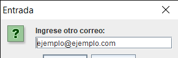

## Tarea Actividad4

### Validaciones por expresiones regulares

- Adjunto link del archivo original de las [Validaciones.java](https://github.com/Alex-pozos/Tareas/tree/main/Tarea4/doc_Java)
- Para poder ejecutar solo basta con copiar el archivo adjunto a un editor de texto y guardar el archivo con lae extencion .java
    - Ejemplo: ejemplo.java
- Abrir la consolo CMD e ir a la ruta donde se enceuntra tu archivo.  
    - Ejemplo: se encuentra en el escritorio debes de ingresar la siguiente ruta
     C:\Users\Admin\Desktop
- Pacompilar el archivo debes de poner.
    - C:\Users\Admin\Desktop>javac ejemplo.java
- Para correr el archivo ya compilado es 
    - C:\Users\Admin\Desktop>javac ejemplo
    - Y listo deberia de poder visualizar las ventanitas como se muestran a continuacion

#### Valores de las validaciones
